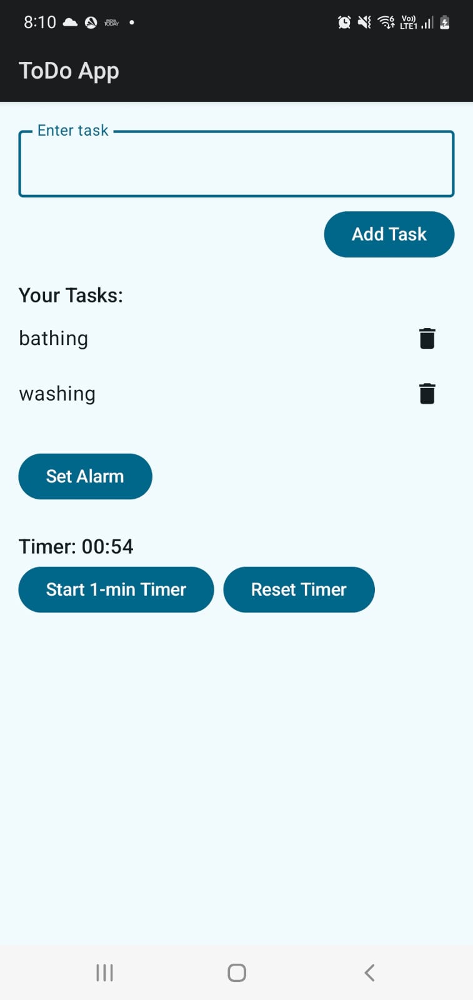

# Compose To-Do, Alarm & Timer App

A simple **Android app** built with **Jetpack Compose** that allows users to:

- Add and delete **To-Do tasks**
- Set an **alarm** using an in-app time picker
- Run a **1-minute timer** with start/reset functionality

This project demonstrates the power of **Compose-only UI**, avoiding traditional XML layouts and themes.

---

## Features

### To-Do List
- Add tasks using a text input
- Delete tasks with a delete icon
- Dynamically updates the list in real-time

### Alarm
- Opens a **TimePicker dialog** within the app
- Launches the system alarm with the chosen time
- Customizable alarm message: `"To-Do Reminder"`

### Timer
- 1-minute countdown timer
- Start and reset buttons
- Timer display updates every second

---

## Screenshots

*You can include screenshots here, for example:*


---

## Tech Stack

- **Kotlin**  
- **Jetpack Compose** (Material3)  
- **Android API 36**  
- Material Icons Extended for task deletion

---

## Setup & Installation

1. Clone the repository:

```bash
git clone https://github.com/yourusername/compose-todo-alarm-timer.git

## **Screenshot**


